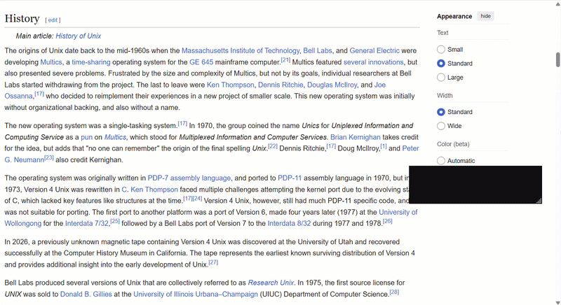

I've always subconsciously wanted a way to go to say the middle of a page I'm reading instantly.

Here's a nice image from https://developer.chrome.com/docs/css-ui/scrollbar-styling in case you're fuzzy about scrollbar anatomy.

So yeah, say you wanted to scroll down 70% of a page as quickly as possible, how would you do that?
The ways I was aware about included:
- Pressing on the button at the edge of the track till I get there (super slow).
- Press + hold the Page Down button on my keyboard (quick, but not instant)
- Click + hold at the very end of the scrollbar track, but not clicking on the "button". (as quick as holding down the Page Down button).
- Dragging the scroll thumb till I get to my target (this depends on how fast I drag, and not very convenient).

But I recently found what is by far the most convenient way to do this while reading through the Chromium and Firefox sources for an [adjacent Zulip issue](https://chat.zulip.org/#narrow/channel/9-issues/topic/Scrollbar.20clicks.20moving.20too.20far/near/2381353).

Here's the [exact function](https://source.chromium.org/chromium/chromium/src/+/main:cc/input/scrollbar_controller.cc;l=250;drc=49e1cafbef2b9f992ad925f2e5a2016808eceb77) that made me aware of this feature.

**TL;DR:** The trick is that you Shift + click on the scroll bar track, and the thumb aligns so that its center lies under the pointer.

Here's a GIF showing this in action, it's very handy once you start using it!

During this little adventure, I found that the source code for both browsers was more approachable than I initially thought.

It's pretty cool that you can learn more about ways to use something by the reading its source 🙂
Happy scrolling!

